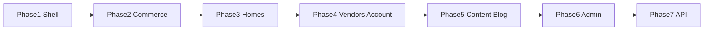

# Full Ecom template → Zcomus frontend plan

**Goal:** Develop **all pages and features** from the AliThemes Ecom LTR template in `zcomus-front` — not MVP-only.

**Visual / UX source:** `C:\Users\Windows\Downloads\Ecom\1.HTML_Template_Frontend_LTR\` (+ dashboard pack `5.HTML_Template_Dashboard\`).

**Defaults:**
- Default homepage: **Home 2** (`index-2.html`)
- Quasar + Pinia + `public/ecom` CSS/assets
- Backend separate; mocks first, then `src/helper/api`
- RTL pack deferred until LTR is complete

---

## Already started (keep)

| Area | Status |
|------|--------|
| Topbar / header / footer | Started |
| Left icon sidebar + subcategory flyouts | Started |
| Home 2 sections | Started |
| Shop grid, PDP v1, cart, checkout, login, register | Started |
| `catalog` / `auth` / `cart` stores + `helper/api` | Started |

---

## Complete page inventory

### A. Shared chrome (every storefront page)

- Topbar (links, free shipping, phone, language, currency)
- Header (logo, category search, main mega menus, account, wishlist badge, cart + mini-cart, compare)
- Left sidebar: icon rail + category list + **subcategories**
- Mobile menu
- Footer
- Quickview modal (global)

### B. Homes (10)

| Route (proposed) | Template |
|------------------|----------|
| `/` | `index-2.html` (default) |
| `/home/1` | `index.html` |
| `/home/3` … `/home/10` | `index-3.html` … `index-10.html` |

### C. Shop & product

| Route (proposed) | Template |
|------------------|----------|
| `/shop` | `shop-grid.html` |
| `/shop/grid-2` | `shop-grid-2.html` |
| `/shop/list` | `shop-list.html` |
| `/shop/list-2` | `shop-list-2.html` |
| `/shop/fullwidth` | `shop-fullwidth.html` |
| `/product/:slug` | `shop-single-product.html` |
| `/product/:slug/layout/2`…`/4` | `shop-single-product-2`…`-4` |

**Features:** filters, sort, pagination, grid/list toggle, quickview, gallery/zoom, variants, add to cart / wishlist / compare.

### D. Cart & engagement

| Route | Template | Features |
|-------|----------|----------|
| `/cart` | `shop-cart.html` | Line items, qty, totals |
| `/checkout` | `shop-checkout.html` | Address, shipping, payment UI |
| `/wishlist` | `shop-wishlist.html` | Wishlist store |
| `/compare` | `shop-compare.html` | Compare table (limited slots) |

### E. Vendors

| Route | Template |
|-------|----------|
| `/vendors` | `shop-vendor-list.html` |
| `/vendors/:slug` | `shop-vendor-single.html` |

### F. Auth & account

| Route | Template |
|-------|----------|
| `/login` | `page-login.html` |
| `/register` | `page-register.html` |
| `/account` | `page-account.html` (profile, orders, addresses, wishlist links) |

### G. Content

| Route | Template |
|-------|----------|
| `/about` | `page-about-us.html` |
| `/contact` | `page-contact.html` |
| `/careers` | `page-careers.html` |
| `/terms` | `page-term.html` |
| 404 | `page-404.html` |

### H. Blog

| Route | Template |
|-------|----------|
| `/blog` | `blog.html` |
| `/blog/alt` | `blog-2.html` |
| `/blog/list` | `blog-list.html` |
| `/blog/big` | `blog-big.html` |
| `/blog/:slug` | `blog-single.html` (+ layout 2/3) |

### I. Admin dashboard (`5.HTML_Template_Dashboard`)

Quasar area under `/admin/*`:

- Dashboard home  
- Products list/grid + create/edit forms (1–4)  
- Categories, brands  
- Orders list/detail/tracking, invoice  
- Sellers list/cards/detail  
- Reviews, transactions, settings  
- Admin login/register, 404, blank  

---

## Phased delivery

1. **Phase 1 — Shell parity**  
   Sidebar open/sticky/mobile, full header menus, mini-cart, wishlist/compare badges, mobile menu.

2. **Phase 2 — Commerce**  
   All shop layouts, PDP 1–4, cart/checkout polish, wishlist, compare, quickview.

3. **Phase 3 — Homes**  
   Home layouts 1 and 3–10 (Home 2 already default).

4. **Phase 4 — Vendors & account**  
   Vendor list/single, full account hub, auth pages match template.

5. **Phase 5 — Content & blog**  
   About, contact, careers, terms, blog variants, styled 404.

6. **Phase 6 — Admin**  
   Full dashboard pack as `/admin`.

7. **Phase 7 — API**  
   Wire `helper/api` + Pinia to Laravel for catalog, cart, wishlist, vendors, orders, blog, admin.

---

## Pinia stores (target)

| Store | Responsibility |
|-------|----------------|
| `catalog` | Categories tree, products, filters |
| `cart` | Cart lines |
| `wishlist` | Wishlist |
| `compare` | Compare list |
| `auth` | Session user |
| `account` | Orders, addresses, profile |
| `vendor` | Vendor list/detail |
| `blog` | Posts |
| `admin` | Admin session + entities (or split later) |

---

## Tracking

Update `docs/FRONTEND_PAGES.md` as each page ships (Built / In progress / Not started).

Backend contracts: extend `docs/BACKEND_HANDOFF.md` when new endpoints are required.

---

## Explicitly later

- RTL frontend (`3` / `4` folders)  
- Pixel-perfect jQuery plugins — use Vue/Quasar equivalents with Ecom CSS  

---

## Confirmation

This plan means **full template parity** for LTR storefront + admin dashboard over the phases above.  
Say **“start phase 1”** (or another phase) when you want implementation to continue.
